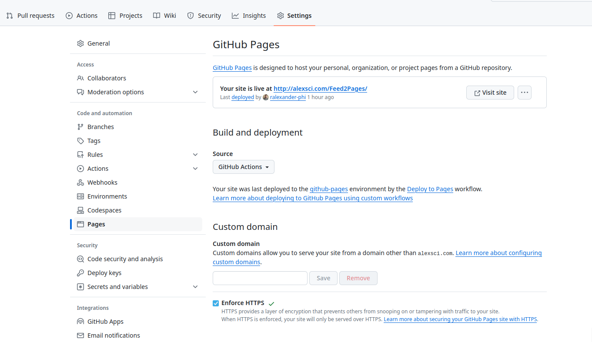

# Feed2Pages

A blogroll that aggregates RSS feeds into your own news feed web site.

## Use cases

* A personal RSS reader you can access from all your devices
* Share what you're reading and promote the RSS feeds you follow
* Aggregate multiple feeds to create a news feed for a particular topic
* Discover new blogs from the bloggers you follow

## Build your own

First fork this repository into your GitHub account.
Then enable GitHub Pages:

1. Open the Settings tab on your repo
2. Select Pages from the lefthand navigation
3. Set the source to GitHub Actions

You can configure a custom domain or enforce HTTPS on this page as well.

## Connect your feeds

If you're already using an RSS feed reader, check if it can export an OPML file.
Export this and save it as `site/static/links.opml`.
You'll need to re-export this file to pick up any changes to who you follow.

You can manage your feed on sites like [FeedLand](https://feedland.com), which publishes your subscriptions at `https://feedland.com/opml?screenname=<yourname>`.
Edit `site/feeds.yaml` and set `feed_url` to the URL of your OPML file.

Alternatively, you can edit the provided sample file (`site/static/links.opml`) manually.
The most important field is `xmlUrl` (which points to the feed URL).

## Running locally

First build the utility:

    $ cd util
    $ go build

Then run hugo:

    $ hugo server

## Promote your links

Add `<link rel="alternate" type="application/opml+xml" href="<your site>/links.opml">`
Software that supports this syntax can help readers of your blog discover what you're reading.

## feeds.yaml settings

`opml`: The URL of your RSS OPML file. You likely don't need to change this, but you can set this to a remote file if you already publish this file elsewhere. There's many public OPML files, like [Awesome RSS Feeds](https://github.com/plenaryapp/awesome-rss-feeds), for example.

`post_age_limit_days`: Filter out posts older than this limit

`max_posts_per_feed`: Include only the newest N posts from each feed. This helps when some feeds publish content much more frequently than others, as they could otherwise fill the news feed.

`max_posts`: Limit the number of posts to display.

`block_words`: Articles that contain any of these words in the title, description, or page content will be filtered out.

`block_domains`: Articles from this domain, or subdomains of this domain, will be filtered out.

## How it works

1. The repository owner configures the RSS feeds they wish to follow
2. They configure settings such as block words to curate the news feed
3. GitHub Actions runs as a periodic (daily) cron job
4. The scraping utility collects articles from RSS feeds
5. The feed contents are normalized and enriched
6. The discovered articles are saved as [Hugo](https://gohugo.io/) pages
7. Hugo builds the site into static HTML
8. GitHub Actions publishes the HTML to GitHub Pages

## Ideas

* Collect articles from popular news website and aggregator RSS feeds, using filters to create a single topic news feed.
  * Hacker News: https://news.ycombinator.com/rss
  * Hacker News RSS: https://hnrss.org
  * Reddit Subreddits: https://www.reddit.com/r/programming.rss
  * Lobsters: https://lobste.rs/t/programming,compsci.rss
  * NY Times: https://rss.nytimes.com/services/xml/rss/nyt/World.xml
  * Many more: https://github.com/plenaryapp/awesome-rss-feeds/blob/master/README.md
